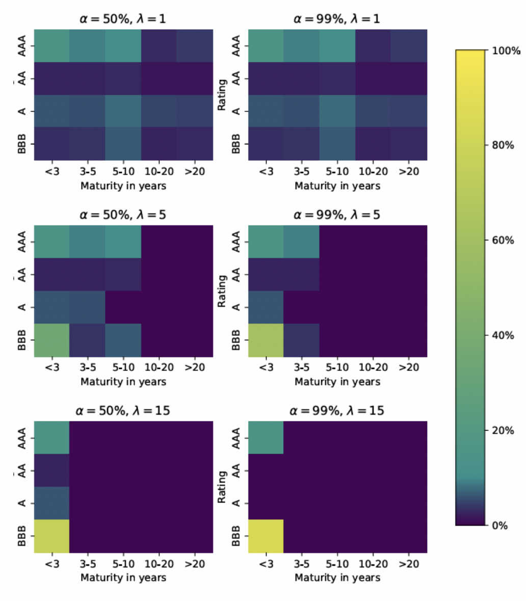

# Robust Bond Portfolio Construction via Convex-Concave Saddle Point Optimization

**Project description:**  
This project explores a robust approach to constructing bond portfolios using convex-concave saddle point optimization. By integrating uncertainty sets and Monte Carlo simulations with theoretical and empirical analysis, we evaluate optimized portfolios against nominal holdings. The study demonstrates reduced volatility and drawdown under worst-case scenarios, offering insights for resilient fixed-income portfolio management.

---

## 1. Introduction

Constructing robust bond portfolios is crucial for mitigating downside risks and achieving stability in fixed-income investments. Using convex-concave saddle point optimization, this project addresses challenges in bond portfolio management by:
- Formulating a robust optimization problem.
- Testing performance under uncertainty using data from iShares Global Aggregate Bond UCITS ETF.
- Validating results with Monte Carlo simulations.

---

## 2. Methodology

### 2.1 Theoretical Framework

#### Bond Portfolio Value:
The portfolio value \(V\) is calculated as:
$$
V = p^\top h = \sum_{i=1}^n \sum_{t=1}^T h_i c_{i,t} e^{-t(y_t + s_i)}
$$

Where:
- \(p\): Bond prices.
- \(h\): Holdings vector.
- \(c_{i,t}\): Cash flows of bond \(i\) at time \(t\).
- \(y_t\): Yield curve at time \(t\).
- \(s_i\): Spread for bond \(i\).

#### Convex-Concave Saddle Point Optimization:
The robust optimization problem is defined as:
$$
\min_{h \in \mathcal{H}} \max_{(y,s) \in \mathcal{U}} \phi(h) - \lambda \Delta_\text{wc}(h)
$$

Where:
- \(\phi(h)\): Nominal objective function (e.g., tracking error, risk terms, transaction cost).
- \(\Delta_\text{wc}(h)\): Worst-case change in portfolio value.
- \(\lambda\): Robustness penalty weight.

**Linearized Approximation:**
To simplify, the change in portfolio value is approximated as:
$$
\Delta_\text{wc}(h) = D_y^\top (y - y_\text{nom}) + D_s^\top (s - s_\text{nom})
$$

Where:
- \(D_y, D_s\): Sensitivities of portfolio value to changes in \(y\) and \(s\).

---

### 2.2 Data and Model Selection

1. **Data:**
   - Bond cash flows derived from coupon rate, maturity, and frequency.
   - Yield and spread data on 2022-09-22.
   - Prices sourced from CBonds and iShares.

2. **Model Selection:**
   - The linearized approximation was used to simplify implementation and focus on modest spread changes over short periods.

3. **Nominal Portfolio:**
   - Our nominal portfolio ℎnom puts weight on each of our 20 bonds equal to the total weight of all bonds in the corresponding rating-maturity group in AGGG. The nominal weights are shown in the figure below.
   
   *Figure 1:  Nominal Portfolio Bond Allocation. *

---

## 3. Experiment

### 3.1 Monte Carlo Simulation with Hull-White Model
The Hull-White model was used to generate yield curves:
$$
dr_t = \kappa(\theta_t - r_t)dt + \sigma dW_t
$$

Where:
- \(\kappa\): Mean reversion rate.
- \(\theta_t\): Long-term mean.
- \(\sigma\): Volatility.

Simulations (1,000 scenarios) were conducted using QuantLib to evaluate portfolio performance under extreme market conditions.

**Key Result:**  

*Figure 2:  Hull White Rate Simulation. *

*Figure 3:  Bond Portfolio Value over time. *
From the above figures, we can conclude that the application of updated weights derived from a linearized solution across both modest and extreme uncertainty sets has demonstrated significant convergence and stability in the bond portfolio's value over a period of at least two years. Notably, the weights derived under the conditions of the extreme uncertainty set have shown greater robustness. This evidence supports the efficacy of the linearized solution in constructing resilient bond portfolios, effectively enhancing portfolio performance amidst varying market conditions.

### 3.2 Robust Portfolio Construction
Optimal holdings were computed for different \(\lambda\) values using DSP and CVXPY packages. The robustness penalty ensured higher allocations to higher-rated and shorter-maturity bonds as \(\lambda\) increased.

---

## 4. Results

1. **Portfolio Allocation:**
   - For \(\lambda = 1\): Weights match nominal allocation.
   - For \(\lambda = 5\): the weights have shifted to shorter maturities, reducing the worst-case change in portfolio.
   - When manually setting the maturities of these bonds to the same value, we find that weights would be assigned to the AAA bond for large values of λ instead
   - Larger lambda leads to more emphasis on bonds with higher rating and shorter maturity

    
    
    *Figure 4:  Portfolio holdings, for both uncertainty sets. *

2. **Backtesting:**
   - Performance tested over three months.
   - Higher \(\lambda\) portfolios showed reduced volatility and drawdown.

**Portfolio Volatility and Drawdown:**

It is obvious that the magnitude of change decreases as lambda increases. This is consistent with our predicted results because lambda stands for the weight of the worst-case part in our objective function. When lambda rises, the importance of the worst-case part also increases, pushing the optimization algorithm to allocate more weight to safer bonds. However, the actual drawdown is far less than the worst case we calculated. But this also makes sense because it is only a theoretical value. In the real market, we do not necessarily reach the worst case. Our overall objective is to build a robust portfolio. From the plot on the right, we can also see that the volatility and drawdown of the portfolio decrease when lambda increases.

*Figure 5:  Portfolio Volatility and Drawdown with different Lambdas. *

---

## 5. Conclusion

This study validates the use of robust optimization for constructing bond portfolios. By incorporating worst-case scenarios into the optimization process:
- Portfolios demonstrated reduced downside risk and improved stability.
- Higher robustness penalty weights (\(\lambda\)) consistently improved portfolio resilience.

Future work could extend this approach to multi-factor uncertainty models and evaluate performance over longer horizons.

---

**References:**

1. Fabozzi, Frank J., et al. *Bond Markets, Analysis, and Strategies*. MIT Press, 2021.  
2. Luxenberg, Eric, Philipp Schiele, and Stephen Boyd. *Robust Bond Portfolio Construction via Convex-Concave Saddle Point Optimization*. arXiv preprint arXiv:2212.02570, 2022.  
3. CBonds: Global data on bonds. <https://cbonds.com>  
4. QuantLib: A library for quantitative finance. <https://quantlib.org>
