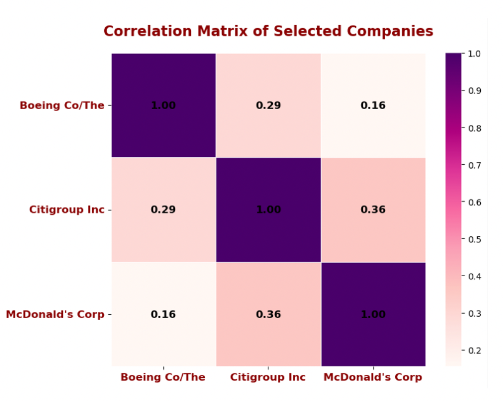
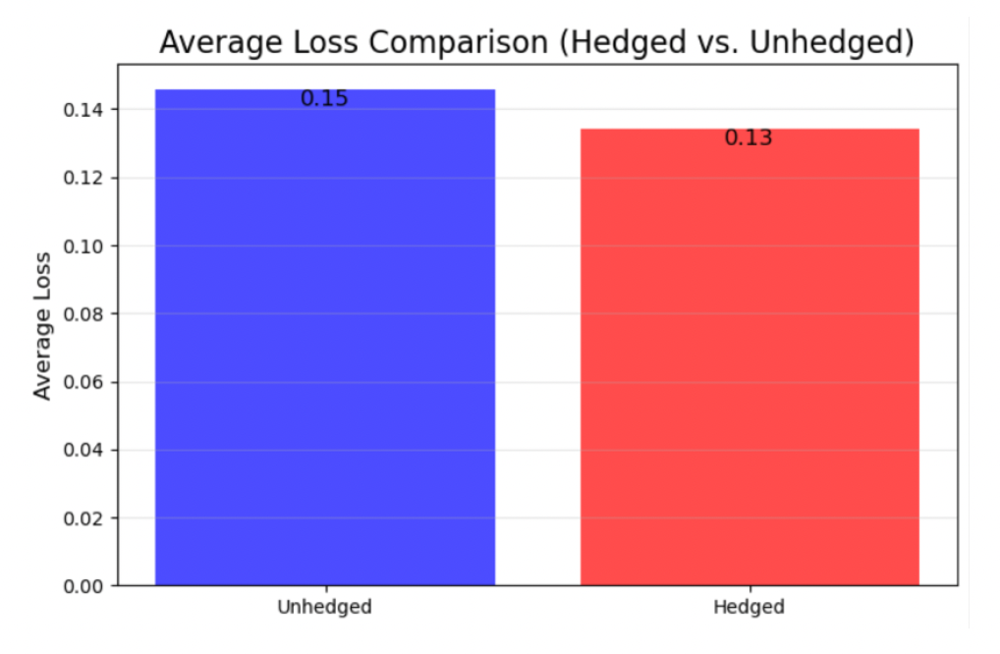

# CVA and Hedging of Counterparty Risk

**Project description:**  
Counterparty risk is a critical yet often overlooked aspect of financial risk management. This study focuses on constructing a hedging portfolio by leveraging credit default swaps (CDS) of the counterparty and applying a closed-form solution to dynamically calculate the required positions. Using historical data, we compare the performance of hedged and unhedged portfolios to evaluate the hedging strategy's effectiveness.

---

## 1. Introduction

Counterparty risk arises from the possibility that one party in a financial contract may fail to meet its obligations. While CDS contracts on the counterparty can mitigate this risk, determining the optimal amount of CDS to hold and adjusting the position dynamically poses a quantitative challenge. This study employs jump processes to model default interactions and derives a closed-form solution for a risk-minimizing hedging strategy.

---

## 2. Methodology

### 2.1 Interacting Default Intensity Model

The default intensity of \(N+1\) entities is modeled as a jump process:

$$
dX_i(t) = \mu_i(X(t))dt + \sum_{k=1}^K \sigma_{ik}(X(t))dW_k(t) + dJ_i(t), \quad X_i(0) = \chi_i
$$

Where:
- \(J_i(t) = \sum_{j=1}^{N+1} w_{ij} H_j(t)\) is the jump process,
- \(w_{ij}\): The impact of entity \(j\)'s default on entity \(i\)'s intensity,
- \(H_j(t)\): Default indicator process of entity \(j\),
- \(\mu_i\), \(\sigma_{ik}\): Drift and volatility coefficients,
- \(W_k(t)\): Brownian motion.

---

### 2.2 Defaultable Claims and CVA

A defaultable claim maturing at \(T\) consists of cash flows and payoffs that depend on the counterparty's default process \(H(t)\). The **credit valuation adjustment (CVA)** quantifies the counterparty risk:

$$
CVA_{N}(t, T) = E \left[ L_{N+1}(\tau_{N+1}) \cdot 1_{\{t < \tau_{N+1} \leq T\}} \cdot \epsilon_N(\tau_{N+1}, T) \mid \mathcal{G}_t \right]
$$

Where:
- \( L_{N+1}(t) \): Loss rate upon counterparty default,  
- \( \epsilon_N(t, T) \): Exposure at default,  
- \( \tau_{N+1} \): Default time of the counterparty.

---

### 2.3 CVA Hedging

Using the Galtchouk-Kunita-Watanabe (GKW) decomposition, the hedging strategy minimizes the variance of hedging error. The optimal strategy is defined as:

$$
\theta^\ast(t) = \frac{d \langle V, Y_{N+1} \rangle (t)}{d \langle Y_{N+1}, Y_{N+1} \rangle (t)}
$$

Where:
- \(V(t)\): Hedging cost process,
- \(Y_{N+1}(t)\): Gain process of the counterparty CDS.

---

## 3. Empirical Study

### 3.1 Data
Historical CDS spread data (2003–2023) for three entities—The Boeing Company, Citigroup Inc., and McDonald’s Corporation—was analyzed. Parameters such as correlation matrix, default intensities (\(X_0\)), mean reversion speeds (\(\mu_0\)), and volatility (\(\sigma_0\)) were initialized.

### 3.2 Simulation
Default intensities were modeled using a jump-diffusion process, incorporating contagion effects:

$$
dX_i(t) = \mu_i X(t) dt + \sum_{k=1}^K \sigma_{ik} X(t) dW_k(t) + dJ_i(t)
$$

**Results:**
- Pre-hedge loss distribution revealed significant risk exposure with long right-tail behavior.
- Post-hedge losses decreased substantially, reducing average losses from 0.15 (pre-hedge) to 0.13 (post-hedge).

---

## 4. Results and Analysis

1. **Correlation Analysis**:
   Correlation coefficients among the entities were modest, indicating limited direct contagion:
   - Boeing-Citigroup: 0.29
   - Citigroup-McDonald’s: 0.36
   - Boeing-McDonald’s: 0.16
  
  
  *Figure 1:  Correlation Matrix of Selected Companies. *

3. **Loss Distribution**:
   - Pre-hedge losses were primarily driven by counterparty default.
   - Post-hedge losses were reduced but incurred CDS costs.
  
   

   *Figure 2:  Loss Distribution Comparison between Pre-hedged and Post-hedged Portfolio. *

   

   *Figure 3:  Average Loss Comparison between Hedged and Unhedged Portfolio. *

---

## 5. Conclusion

This study demonstrates the effectiveness of a risk-minimizing CVA hedging strategy using counterparty CDS. By leveraging the GKW decomposition, the strategy dynamically adjusts positions, reducing portfolio losses under counterparty risk. Future research could explore:
- Incorporating stochastic recovery rates,
- Testing the strategy under stressed market conditions,
- Optimizing rebalancing to minimize hedging costs.

---

**References**  
1. Azizpour, S., Giesecke, K., & Schwenkler, G. (2018). Exploring the sources of default clustering. *Journal of Financial Economics*, 129(1), 154–183.  
2. Schweizer, M. (2008). Local risk-minimization for multidimensional assets and payment streams. *Banach Cent. Publ.*, 83, 213–229.  
