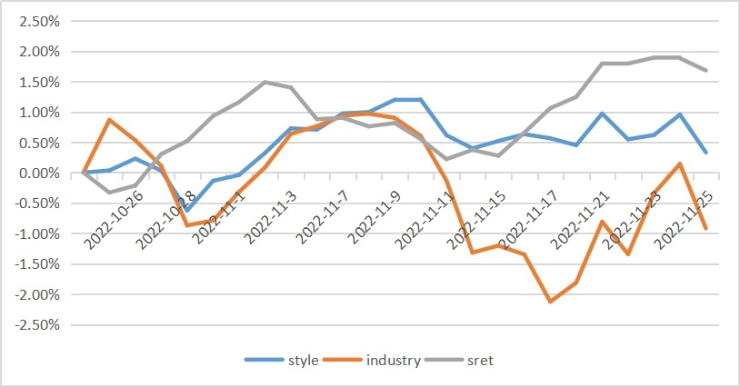
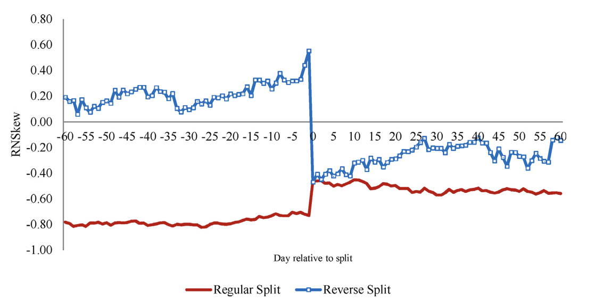

## About Me
I'm a recent graduate of Boston University's Mathematical Finance & Financial Technology program (Class of 2025). With a strong foundation in finance, programming, and quantitative analysis, I specialize in building data-driven financial models and strategies. My skills include Python, R, SQL, C++, and machine learning techniques, with applications in fix income, portfolio management, credit risk, deep learning, and algorithmic trading.

Passionate about the intersection of finance and technology, I enjoy solving complex problems and creating innovative solutions. Feel free to explore my projects here and connect with me on LinkedIn.

---

## Skills
**Programming**: Python, SQL, R, C++, Pandas, NumPy, Scikit-learn, SciPy, TensorFlow, VBA, MATLAB, STATA, LaTeX

**Methods**: MLE, OLS, Time Series, Bayesian, Factor Modeling, VaR, Monte Carlo，Machine Learning, Deep Learning

---

## Internship

---

### ASL Capital Markets Inc. - Quantitative Analyst Intern

[Fixed Income ETF Hedging](/sample_page.md)

---

### CCX Indices, - Quantitative Analyst Intern
[Portfolio Analysis and Factor Attribution](/nominal_price_illusion.md)

[Nominal Price Illusion](/nominal_price_illusion.md)

---

### Category Name 2

- [Project 1 Title](http://example.com/)
- [Project 2 Title](http://example.com/)
- [Project 3 Title](http://example.com/)
- [Project 4 Title](http://example.com/)
- [Project 5 Title](http://example.com/)

---

---

Page template forked from <a href="https://github.com/evanca/quick-portfolio">evanca</a>

<!-- Remove above link if you don't want to attibute -->
