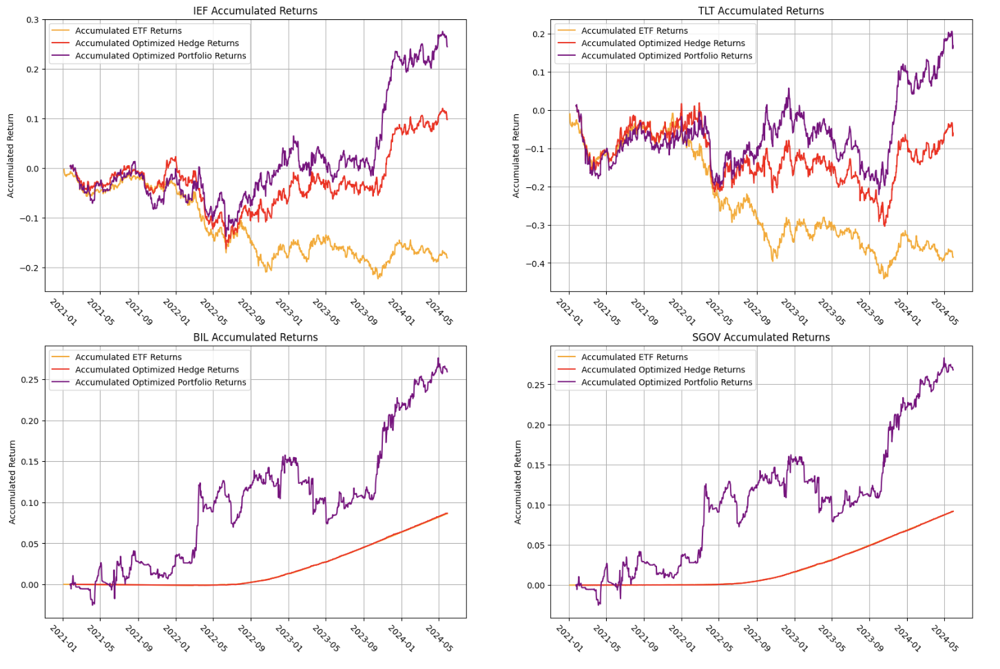

## About Me
I'm a recent graduate of Boston University's Mathematical Finance & Financial Technology program (Class of 2025). With a strong foundation in finance, programming, and quantitative analysis, I specialize in building data-driven financial models and strategies. My skills include Python, R, SQL, C++, and machine learning techniques, with applications in fix income, portfolio management, credit risk, deep learning, and algorithmic trading.

Passionate about the intersection of finance and technology, I enjoy solving complex problems and creating innovative solutions. Feel free to explore my projects here and connect with me on LinkedIn.

---

## Skills
**Programming**: Python, SQL, R, C++, Pandas, NumPy, Scikit-learn, SciPy, TensorFlow, VBA, MATLAB, STATA, LaTeX

**Methods**: MLE, OLS, Time Series, Bayesian, Factor Modeling, VaR, Monte Carlo，Machine Learning, Deep Learning

---

## Internship

### ASL Capital Markets Inc. - Quantitative Analyst Intern

[Fixed Income ETF Hedging](/sample_page.md)

### CCX Indices, - Quantitative Analyst Intern
[Portfolio Analysis and Factor Attribution](/Code/CCXD/ESG_report/statistics.py)

[Nominal Price Illusion](/nominal_price_illusion.md)

---

## Project
- [3D Tensor-based Deep Learning Models for Predicting Option Price](/796.md)

- [Robust Bond Portfolio Construction via Convex-Concave Saddle Point Optimization](/728.md)

- [CVA and Hedging of Counterparty Risk](/772.md)

---

## Career Objectives
- Quant Analyst
- Quant Risk Analyst
- Portfolio Analyst/Asset Management
- Data Analyst

---

## Hobbies and Interests
- Baking
- Photograph
- Pop music/Jazz
- Suspense: Inception, The Prestige, Knives Out, True Detective, Sherlock 

---

---

Page template forked from <a href="https://github.com/evanca/quick-portfolio">evanca</a>

<!-- Remove above link if you don't want to attibute -->
